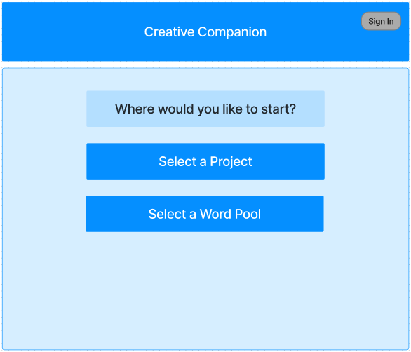
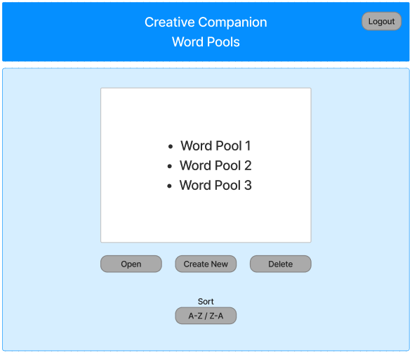
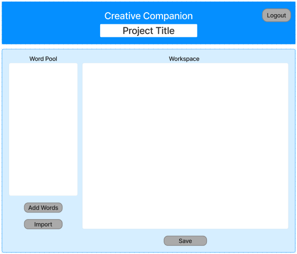
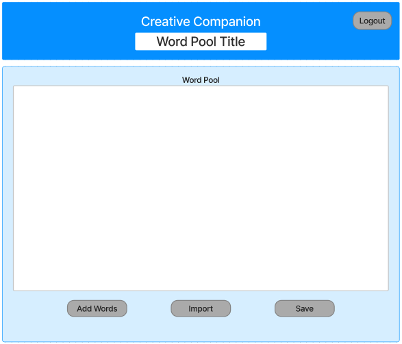

# Design Document

## Creative Companion

## 1. Problem Statement

Create a software program that seamlessly integrates with external thesaurus and rhyming dictionary APIs, empowering writers, poets, and lyricists to construct dynamic "Word Pools." These Word Pools facilitate the creation of song lyrics, poetry, or prose within dedicated workspaces. Each user's creative work is efficiently managed as individual "Projects," where they can organize, edit, and securely store their content for easy retrieval and further development. This versatile solution serves as an essential tool for artists, enabling creative expression and streamlined content management.

## 2. Top Questions to Resolve in Review

1. Scope: How many features should we have?
2. What would be the best way to save the text contents of the fields to the database - as JSON strings?
3. What information is needed to create a personal project or word pool? What should the user be able to name it?
4. How should project deletion work? Is there any data retention policy?
5. What are the specifics of sorting projects or word pools by date created, date modified, or alphabetically?
6. How should changes to a project be saved? Is there an autosave feature?
7. Do word pools share similar features with projects like creation, deletion, sorting, and editing?
8. What are the integration requirements of the APIs used to populate the word pools?

## 3. Use Cases

###### Projects

U1. As a CC customer, I want to be able to create a personal project that consists of a project wordpool and a project workspace

U2. As a CC customer, I want to be able to delete a personal project

U3. As a CC customer, I want to be able to change the name of a project

U4. As a CC customer, I want to be able to view all my projects

U7. As a CC customer, I want to be able to sort the projects by projectName (A-Z or Z-A)

U8. As a CC customer, I want to be able to open / import a selected project (which includes the project wordpool and workspace contents) from the projects list to edit

U9. As a CC customer, I want to be able to update / save changes (to the project wordpool and workspace) as a project to the database

###### WordPools

U10. As a CC customer, I want to be able to create an independent wordpool 

U11. As a CC customer, I want to be able to delete an independent wordpool

U12. As a CC customer, I want to be able to change the name of an independent wordpool

U13. As a CC customer, I want to be able to view all my independent wordpools

U16. As a CC customer, I want to be able to sort the independent wordpools by A-Z or Z-A

U17. As a CC customer, I want to be able to open / import a selected wordpool from the independent wordpools list into a project wordpool to edit

U18. As a CC customer, I want to be able to update / save changes to an independent wordpool

###### Thesaurus / Rhyming Dictionary Sources

U19. As a CC customer, I want to be able to query a Thesaurus / Rhyming Dictionary API to populate a project wordpool field with text in my project

U20. As a CC customer, I want to be able to query a Thesaurus / Rhyming Dictionary API to populate a field with text in an independent wordpool

###### Drag and Drop 

U20. As a CC customer, I want to be able to drag text from the project wordpool field and drop it in an editable workspace inside the chosen project

U21. As a CC customer, I want to be able to manually drag text from within the project workspace and drop it in a different location within the same project workspace itself

Stretch goals

S1. As a CC customer, I want to be able to use the Elements of Eloquence as templates for querying to populate the word pool

S2. As a CC customer, I want to be able to export the contents of a project as a .txt file to an email address.

S3. As a CC customer, I want to be able to count how many times a word is used in a project

S4. As a CC customer, I want to be able to get the percentage of times a word is used relative to the rest of the contents in a project

S5. As a CC customer, I want to be able to count how many times a word belonging to a certain sentiment is used in a project

S6. As a CC customer, I want to be able to search projects containing a certain word or phrase

S7. As a CC customer, I want to be able to use an LLM or existing Java libraries to populate the word pool

S8. As a CC customer, I want to be able to have a display name separate from my userId

U5. As a CC customer, I want to be able to sort the projects by date created

U6. As a CC customer, I want to be able to sort the projects by date last modified

U14. As a CC customer, I want to be able to sort the wordpools by date created

U15. As a CC customer, I want to be able to sort the wordpools by date last modified

U22. As a CC customer, I want to be able to sort words in the word pool - Alphabetically

U23. As a CC customer, I want to be able to sort words in the word pool - Randomly

U24. As a CC customer, I want to be able to sort words in the workspace - Alphabetically

U25. As a CC customer, I want to be able to sort words in the workspace - Randomly

## 4. Project Scope

### 4.1. In Scope

* Create, delete, retrieve, sort and edit projects
* Create, delete, retrieve, sort and edit independent wordpools
* Query external APIs to populate project wordpools and independent wordpools
* Drag and drop text from the project wordpool to project workspace

### 4.2. Out of Scope

* Implement Elements of Eloquence query templates
* Export project as .txt
* Data analysis on text content
* Searching projects for a certain word or phrase
* Implement an LLM or existing Java libraries to populate the word pool
* Update a display name separate from UserId
* Sorting text in the wordpool and workspace

# 5. Proposed Architecture Overview

## Project Phase: Minimum Lovable Product (MLP) Delivery
### Description:
In this initial phase, our goal is to deliver the Minimum Lovable Product (MLP) for our software project. The MLP will encompass core functionalities, including project creation, deletion, retrieval, and updating. Additionally, it will involve fetching content from external APIs to populate a word pool and workspace, allowing customization to meet specific user needs.

### Key Components:

#### API Gateway:

We will utilize AWS API Gateway to manage and expose a set of RESTful endpoints to the outside world. These endpoints are designed to handle project-related actions.

#### AWS Lambda:

AWS Lambda functions will be used to implement serverless compute for our project. The Lambda functions we will create will each be responsible for specific actions related to project management and content modification.

###### Endpoints:

The endpoints defined in section 6.2 are designed to facilitate various project-related operations. These endpoints include, but are not limited to:

* Project Creation: An endpoint to create new projects.
* Project Deletion: An endpoint to delete a project.
* Project Retrieval: Endpoints for retrieving project details and content.
* Project Update: Endpoints for updating existing projects.
* Word Pool Population: Endpoints for fetching content from external APIs to populate a word pool.
* Workspace Customization: Endpoints for customizing the workspace within a project.

###### Functionality:

* Project Management:

1. Users can create new projects, delete existing projects and retrieve project information.
2. Projects can be updated as needed to accommodate changes or additions.

* Content Integration:

1. External APIs will be accessed to fetch content, which is then populated into the word pool and workspace.

###### Scalability:

* The serverless architecture offered by AWS Lambda allows for easy scalability. Additional Lambda functions can be added to handle increased load as the project grows.

###### Security:

* Security and authentication will be managed through AWS Cognito to protect user data and project content.

###### Customization:

* Users will have the ability to customize and modify the content within their projects and wordpools to suit their specific requirements.


# 6. API

## 6.1. Public Models

```
// ProjectModel

String userId;
String projectId;
String projectName;
List<String> wordpool;
List<String> workspace;
```
```
// WordpoolModel

String userId;
String wordpoolId;
String wordpoolName;
List<String> wordpool;

```


## 6.2. Endpoints

### Projects

* Accepts POST requests to /projects
###### Accepts a projectName and returns the corresponding ProjectModel including a unique projectId assigned by the Project Service.

* Accepts DELETE requests to /projects/{projectid}
###### Accepts a userId and a projectId and removes a project from user’s projects.

* Accepts GET requests to /projects/{projectid}
###### Accepts a userId and a projectId and returns the corresponding ProjectModel.

* Accepts GET requests to /projects
###### Accepts a userId and returns a list of corresponding ProjectModels.

* Accepts PUT requests to /projects/{projectid}
###### Accepts data to update a project including an updated projectName.


### Wordpools

* Accepts POST requests to /wordpools
###### Accepts a wordpoolName and returns the corresponding WordpoolModel including a unique wordpoolId assigned by the Wordpool Service.

* Accepts DELETE requests to /wordpools/{wordpoolid}
###### Accepts a userId and a wordpoolId and removes a wordpool from user’s wordpools.

* Accepts GET requests to /wordpools/{wordpoolid}
###### Accepts a userId and a wordpoolId and returns the corresponding WordpoolModel.

* Accepts GET requests to /wordpools
###### Accepts a userId and returns a list of corresponding WordpoolModels.

* Accepts PUT requests to /wordpools/{wordpoolid}
###### Accepts data to update a wordpool including an updated wordpoolName.


# 7. Tables

### 7.1. `Projects`

```
userid // partition key, string
projectid // sort key, string
projectname // string
projectwordpool // List
workspace // List
```

### 7.2. `WordPools`

```
userid // partition key, string
wordpoolid // sort key, string
wordpoolname // string
wordpool // List
```

# 8. Pages












