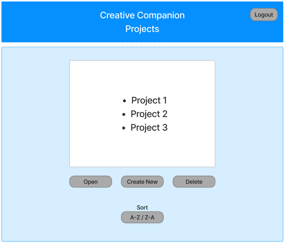

# Design Document

## Creative Companion

## 1. Problem Statement

Develop a software program that populates a dynamic word pool by interfacing with external thesaurus and rhyming dictionary APIs. This word pool should then allow users to seamlessly drag and drop these words into a target field, facilitating the creation of original song lyrics, poetry, or prose. The software should also support the organization, rearrangement, and editing of these text elements. The content can be saved as individual projects to a database, ensuring that users can retrieve and further develop their work at any time.

## 2. Top Questions to Resolve in Review

1. Scope: How many features should we have?
2. How many of the items should be POJOs?
3. What would be the best way to save the text contents of the fields to the database - as JSON strings?
4. Do you know of any other teams out there who are working on related problems? Or might have the same concerns about how to best structure the data for use as well as database storage?

## 3. Use Cases

U1. As a CC customer, I want to be able to create a personal project

U2. As a CC customer, I want to be able to delete a personal project

U3. As a CC customer, I want to be able to view all my projects

U4. As a CC customer, I want to be able to sort the projects by date created

U5. As a CC customer, I want to be able to sort the projects by date last modified

U6. As a CC customer, I want to be able to sort the projects by A-Z or Z-A

U7. As a CC customer, I want to be able to change the name of a project

U8. As a CC customer, I want to be able to open / import a selected project from the projects list to edit

U9. As a CC customer, I want to be able to update / save changes to a project

U10. As a CC customer, I want to be able to query a Thesaurus API to populate a word pool field with text in my project

U11. As a CC customer, I want to be able to query a Rhyming Dictionary API to populate a word pool field with text in my project

U12. As a CC customer, I want to be able to drag text from the word pool field and drop it in an editable work space (target field)

U13. As a CC customer, I want to be able to manually drag text from within the work space and drop it in a different location within the work space itself (target field)

U14. As a CC customer, I want to be able to sort words in the word pool - Alphabetically

U15. As a CC customer, I want to be able to sort words in the word pool - Randomly

U16. As a CC customer, I want to be able to sort words in the work space - Alphabetically

U17. As a CC customer, I want to be able to sort words in the work space - Randomly

Stretch goals

S1. As a CC customer, I want to be able to use the Elements of Eloquence as templates for querying to populate the word pool

S2. As a CC customer, I want to be able to export the contents of a project as a .txt file to an email address.

S3. As a CC customer, I want to be able to count how many times a word is used in a project

S4. As a CC customer, I want to be able to get the percentage of times a word is used relative to the rest of the contents in a project

S5. As a CC customer, I want to be able to count how many times a word belonging to a certain sentiment is used in a project

S6. As a CC customer, I want to be able to search projects containing a certain word or phrase

S7. As a CC customer, I want to be able to use an LLM or existing Java libraries to populate the word pool

S8. As a CC customer, I want to be able to have a display name separate from my UserId

## 4. Project Scope

### 4.1. In Scope

* Create, delete, retrieve, sort and edit projects
* Query external APIs to populate word pool
* Drag and drop text in the word pool and work space
* Sorting text in the word pool and work space

### 4.2. Out of Scope

* Implement Elements of Eloquence query templates
* Export project as .txt
* Data analysis on text content
* Searching projects for a certain word or phrase
* Implement an LLM or existing Java libraries to populate the word pool
* Update a display name separate from UserId

# 5. Proposed Architecture Overview

## Project Phase: Minimum Lovable Product (MLP) Delivery
### Description:
In this initial phase, our goal is to deliver the Minimum Lovable Product (MLP) for our software project. The MLP will encompass core functionalities, including project creation, retrieval, and updating. Additionally, it will involve fetching content from external APIs to populate a word pool and workspace, allowing customization to meet specific user needs.

### Key Components:

#### API Gateway:

We will utilize AWS API Gateway to manage and expose a set of RESTful endpoints to the outside world. These endpoints are designed to handle project-related actions.

#### AWS Lambda:

AWS Lambda functions will be used to implement serverless compute for our project. The Lambda functions we will create will each be responsible for specific actions related to project management and content modification.

###### Endpoints:

The endpoints defined in section 6.2 are designed to facilitate various project-related operations. These endpoints include, but are not limited to:

* Project Creation: An endpoint to create new projects.
* Project Deletion: An endpoint to delete a project.
* Project Retrieval: Endpoints for retrieving project details and content.
* Project Update: Endpoints for updating existing projects.
* Word Pool Population: Endpoints for fetching content from external APIs to populate the word pool.
* Workspace Customization: Endpoints for customizing the workspace within a project.

###### Functionality:

* Project Management:

1. Users can create new projects, delete existing projects and retrieve project information.
2. Projects can be updated as needed to accommodate changes or additions.

* Content Integration:

1. External APIs will be accessed to fetch content, which is then populated into the word pool and workspace.

###### Scalability:

* The serverless architecture offered by AWS Lambda allows for easy scalability. Additional Lambda functions can be added to handle increased load as the project grows.

###### Security:

* Security and authentication will be managed through AWS Cognito to protect user data and project content.

###### Customization:

* Users will have the ability to customize and modify the content within their projects to suit their specific requirements.


# 6. API

## 6.1. Public Models

```
// UserModel 
String userId; 
String displayName; 
********List userProjects; //S = projectId

```

```
// ProjectModel

String projectId;
String projectName;
String userId;
Date creationDate;
Date lastModified;
List<String> wordPool;
List<String> workspace;

```


## 6.2. Endpoints

### User

* Accepts POST requests to /user
###### Accepts a displayName and unique userId and returns the corresponding UserModel.

* Accepts PUT requests to /user
###### Accepts data to update a displayName.

* Accepts GET requests to /user/{userId}
###### Accepts a userId and returns corresponding user.

### Project

* Accepts POST requests to /project
###### Accepts a projectName and userId and returns the corresponding ProjectModel including a unique projectId assigned by the Project Service.

* Accepts DELETE requests to /project
###### Accepts a userId and a projectId and removes a project from user’s projects.

* Accepts GET requests to /project/{projectId}
###### Accepts a userId and a projectId and returns the corresponding ProjectModel.

* Accepts PUT requests to /project/{projectId}
###### Accepts data to update a project including an updated projectName.


# 7. Tables

### 7.1. `User`

```
userId // partition key, string
displayName // string
```
### 7.2. `Project`

```
id // partition key, string
pantryName // sort string, string
userId // string
creationDate // Date (string?)
lastModified // Date (string?)
wordPool // List<String> (JSON string?)
workspace // List<String> (JSON string?)
```

# 8. Pages





